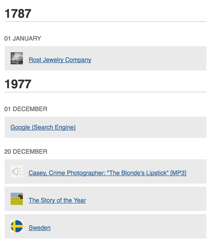

# Timeline Shortcode
An Omeka plugin that adds a shortcode for displaying a list of items sorted by date.

## Usage

Use the shortcode `[timeline_list]` to add the list to a page. Required arguments are `element` and `value`. Optionally, include `featured='true'` to limit results to only featured items.

### Example

    [timeline_list element='Subject' value='some subject']

### Requirements

**Supported date formats**:
- mm/dd/yyy (e.g. 12/31/1999)
- yyyy (e.g. 1999)
- circa yyyy (e.g. circa 1999)
- 12311977 (e.g. 12311999)
- Month yyyy (e.g. December 1999)
- Any two of the above separated by a single hyphen or endash
- dd-mm-yyy (e.g. 31-12-1999)

_Dates before common era are not supported. Years without a specific date will default to January 1st. Month and year combinations without a specific date will default to the first of the month. Date spans will be displayed using only the first date._

**Server requirements**: Different server platforms and PHP versions may handle certain dates differently. See [documentation for PHP strtotime](https://secure.php.net/manual/en/function.strtotime.php). If you notice all your properly formatted dates being listed as 1970 (or today), your server may not meet the requirements.

